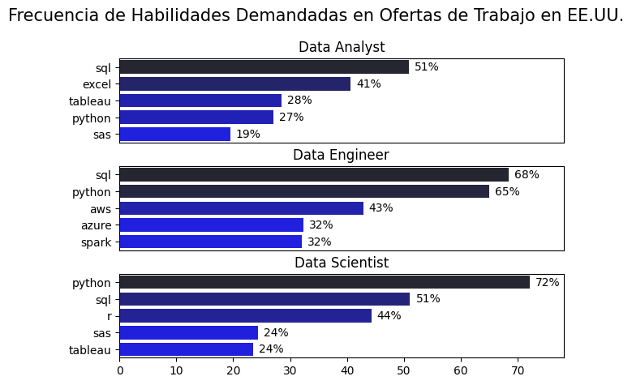

# Python_Proyecto

# Analisis
## 1. ¿Cuáles son las habilidades más demandadas para los 3 roles de datos más populares?

Para identificar las habilidades más solicitadas en los 3 puestos de datos más populares, primero filtré los cargos según su popularidad y luego extraje las 5 habilidades principales para cada uno. Este análisis destaca los títulos de trabajo más populares y sus habilidades clave, indicando qué competencias debería priorizar según el rol que me interese.

Mira mi notebook con los pasos detallados aqui:
[SkillsCount.ipynb](/SkillsCount.ipynb)

### Visualizar Datos

``` python
fig, ax = plt.subplots(len(job_titles), 1)

for i, job_title in enumerate(job_titles):
  df_plot = df_skills_perc[df_skills_perc['job_title_short'] == job_title].head(5)
  sns.barplot(data=df_plot, x='skill_percent', y='job_skills', ax=ax[i], hue='skill_count',palette='dark:b_r')

plt.show()
```

### Resultados


### Hallazgos clave
 - Python es una habilidad versátil y altamente demandada en los tres roles, pero destaca especialmente para Científicos de Datos (72%) e Ingenieros de Datos (65%).
 - SQL es la competencia más solicitada para Analistas de Datos y Científicos de Datos, apareciendo en más de la mitad de las ofertas laborales para ambos roles. Para Ingenieros de Datos, Python es la habilidad más requerida (presente en el 68% de las ofertas)
 - A los ingenieros de datos se les exige competencias técnicas más especializadas (AWS, Azure, Spark), a diferencia de Analistas y Científicos de Datos, quienes necesitan dominar herramientas más generales de gestión y análisis de datos (Excel, Tableau).


## 2. Cuales son las habilidades mas demandadas para los analistas de datos?

Mira mi notebook con los pasos detallados aqui:
[SkillsTrend.ipynb](/SkillsTrend.ipynb)

### Visualizar Datos

``` python

from matplotlib.ticker import PercentFormatter
ax = plt.gca()
ax.yaxis.set_major_formatter(PercentFormatter(decimals=0))

for i in range(5):
  plt.text(11.2, df_plot.iloc[-1, i], df_plot.columns[i])

plt.show()

```

### Resultados


*Grafica en la que se visualiza las habilidades mas buscadas para analistas de datos en Estados Unidos*

### Hallazgos clave
- SQL sigue siendo la habilidad mas demandada a lo largo de los años, aun asi muestra un decrecimiento gradual.
- La experiencia en Excel esta en un significante crecimiento, pasando por encima de Python y de Tableau al final del año.
- Para Python y Tableau se muestra una demanda relativamente estable a lo largo del año con algunas flucutaciones.

## 3. Cual es el pago segun las habilidades para los analistas de datos?

### Analisis de salario para roles en datos

### Visualizar datos

``` python
sns.boxplot(data=df_US_top6, x='salary_year_avg',y='job_title_short', order=job_order)

ticks_x = plt.FuncFormatter(lambda y, pos: f'${int(y/1000)}K')
plt.gca().xaxis.set_major_formatter(ticks_x)
plt.show()
```

### Resultados

*Grafica de la distribucion del salario para el top 6 de trabajos en datos.*
### Hallazgos Clave

- Hay una variacion significante en el rango de los salarios de los diferentese trabajos. Las posiciones de Cientifico de datos Senior tienden por tener los salarios mas altos, con mas de $600K, indicando un alto valor por las avanzadas habilidades y experiencia en la industria.
- Ingeniero de datos Senior y Cientifico de datos Senior muestran un número considerable de valores atípicos en el extremo superior del espectro salarial, lo que sugiere que habilidades excepcionales o circunstancias particulares pueden llevar a remuneraciones altas en estos roles. En contraste, los roles de Analista de Datos presentan una mayor consistencia en los salarios, con menos valores atípicos.
